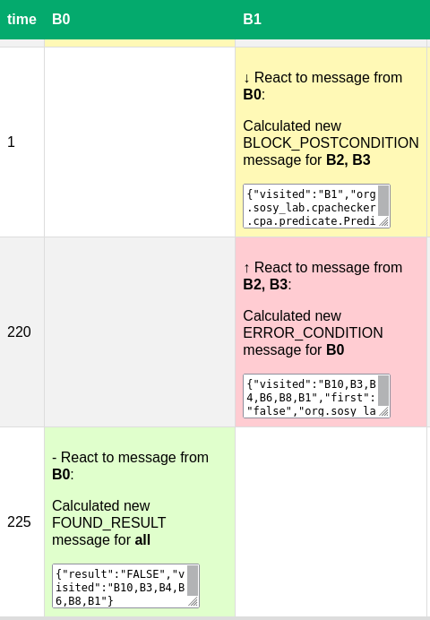

<!--
This file is part of CPAchecker,
a tool for configurable software verification:
https://cpachecker.sosy-lab.org

SPDX-FileCopyrightText: 2022 Dirk Beyer <https://www.sosy-lab.org>

SPDX-License-Identifier: Apache-2.0
-->

# Adjustable Code Block Analysis - Visualization

## Overview
The script `log_to_html.py` parses the debug-output of 
the concurrent adjustable block analysis. 
By default, the output is written to the output directory of CPAchecker.
The visualization produces an HTML-table listing all messages 
sorted ascending by time of creation.
Spawned workers represent the columns of the table.
In case, workers create message simultaneously the messages 
appear in the same row but in the respective column for the worker.
The entries contain the message type 
and the payload in its string representation.
The visualization is mainly useful for debugging as it may be hard to track messages 
on multiple threads.

## Setup

Install the Python requirements listed in `requirements.txt`,
e.g., with `pip install -r requirements.txt`.

## Options

Run `./log_to_html.py --help` to see a list of the available
command-line options.

## Example

### Running the command

Directory `example_input/` contains example JSON files for
running the visualization.

Example run:

```
$ ./log_to_html.py \
    --messages-json example_input/block_analysis.json \
    --block-structure-json example_input/blocks.json
    --output output 
```

The command exits silently.  
The output is stored in `output/` and all data is accessible as HTML `report.html`.

## Visualization

You can find an example for the visualization below.

In the table,
the columns represent the workers operating on blocks `B0` and `B1`.
Forward analyses produce yellow messages while backward analyses color them red.
Results are colored in green.
The rows are sorted ascending by time of creation. 
In this case, the numbers `1`, `220`, and `225` tell us 
that the messages were created `1`, `220`, and `225` millisecond 
after the first message was sent. 

