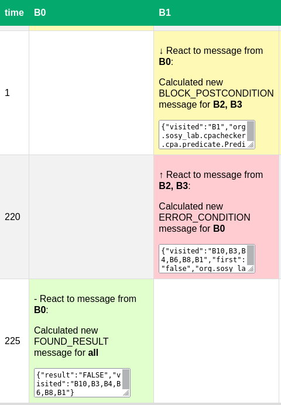

<!--
This file is part of CPAchecker,
a tool for configurable software verification:
https://cpachecker.sosy-lab.org

SPDX-FileCopyrightText: 2022 Dirk Beyer <https://www.sosy-lab.org>

SPDX-License-Identifier: Apache-2.0
-->

# Distributed Summary Synthesis - Message Visualization

## Overview

`log_to_html.py` turns the messages that the `DssVisualizationWorker` exports
during a run of the distributed-summary-synthesis (DSS) algorithm into an
interactive HTML report.
Tracking messages across many workers in a log file is hard;
the report makes the message exchange readable at a glance.

The report offers two views on the same data:

* **Table view** - one column per block, one row per point in time.
  Use it to see which blocks talk to each other and when.
* **Timeline view** - all messages in chronological order, independent of the
  sender. Use it to follow a single causal chain.
* **Graph view** - the block graph itself, clickable. Use it to reason about a
  block in its context.

In the graph view, a block is shaded by how much traffic it produced, the root
block and blocks that reported an exception are outlined, and blocks with no
message in the current filter are dimmed. Clicking a block highlights its
predecessors and successors and fills the panel next to it with the block's
facts and code, the decoded latest message *per type*, and the full list of its
messages. The scrubber below the graph replays the run message by message: it
lights up the sender and the edges the message travels along, so a
back-and-forth between two blocks becomes visible as a pattern. `▶` replays
automatically, the arrow keys step by hand.

Every message is rendered as a card that shows

* the message type (post condition, violation condition, result, witness,
  exception) and the blocks it travels from and to,
* the decoded content: the flat `state<i>.<CPA>.<field>` key space of a message
  is regrouped per contained abstract state and per CPA, machine-only blobs
  (such as the serialized pointer-target set) are elided, and the serialized
  `BlockState` is expanded into its block id, its block-graph history and the
  size of its witness,
* what changed with respect to the previous message of the same type from the
  same block, with the old and the new value side by side, and
* a **repeat** badge if the content is byte-identical to that previous message.

The columns of the table view are necessarily narrow, so every card carries a
`⤢` button (or double-click its header) that opens the decoded content in a
full-width viewer. Expanding *View content* in place works too and widens the
cell. Use `--max-value-length` if the abbreviated formulas cut off too early.

The change list and the repeat badge are the ones to look at when a fixpoint is not reached: a
block that keeps broadcasting is only making progress if its messages actually
change, and *what* changes (the predicate, the witness, the history) says which
part of the analysis is diverging.

Exceptions get their own panel at the top of the report, so a crashed worker is
never hidden behind a filter.

For the corresponding debugging helpers on the Java side (rendering states,
messages, block graphs, block-graph paths and reached sets as readable text),
see `DssDebugUtils` in the `distributed_summaries` package.

## Setup

Install the Python requirements listed in `requirements.txt`,
e.g., with `pip install -r requirements.txt`.

## Producing the input

The visualization worker only runs in debug mode, so the analysis has to be
started with:

```
bin/cpachecker --config config/dss.properties \
    --option distributedSummaries.debug=true program.c
```

This writes one JSON file per message to `output/block_analysis/messages` and
the block structure to `output/block_analysis/blocks.json`.

The message files are numbered `M0.json`, `M1.json`, ... and the numbering
restarts with every run, so a new run overwrites the beginning of an older one.
Every message carries an `identifier` that is unique per run; the script uses it
to visualize a single run and warns when parts of that run were overwritten.
`blocks.json` is overwritten per run as well, so visualizing an *older* run pairs
its messages with a newer block structure; the script warns when it finds senders
that are not blocks of the graph, which is the symptom of that mismatch.
**Delete `output/block_analysis` before a run** to get a complete picture.

## Usage

```
./log_to_html.py
```

visualizes the most recent run found in `output/block_analysis/messages` and
opens the report in a browser.

Useful options (see `./log_to_html.py --help` for the full list):

| Option | Purpose |
| --- | --- |
| `--list-runs` | List the runs contained in the message directory and exit. |
| `--run <identifier>` | Visualize a specific run instead of the most recent one. |
| `--limit <n>` | Render only the last `n` messages. Long runs produce very large reports. |
| `--bucket-ms <ms>` | Group messages sent within the same time bucket into one row. |
| `--no-browser` | Only write the report, do not open it. |
| `--messages-json`, `--block-structure-json`, `-o` | Input and output locations. |

## Example

Directory `example_input/` contains a small, complete example:

```
$ ./log_to_html.py \
    --messages-json example_input/messages \
    --block-structure-json example_input/blocks.json \
    --output output
```

The report is written to `output/report.html`, next to a rendering of the block
graph in `output/graph.dot` and `output/graph.png`.

## Visualization

An older version of the table view is shown below.
The columns represent the workers operating on blocks `B0` and `B1`,
forward analyses produce yellow messages while backward analyses color them red,
and results are colored green.
The rows are sorted ascending by time of creation, given in milliseconds
relative to the first message of the run.


