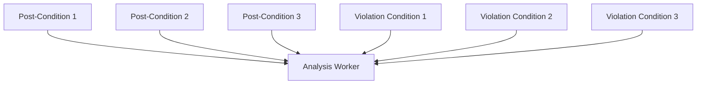

<!--
This file is part of CPAchecker,
a tool for configurable software verification:
https://cpachecker.sosy-lab.org

SPDX-FileCopyrightText: 2026 Dirk Beyer <https://www.sosy-lab.org>

SPDX-License-Identifier: Apache-2.0
-->

# Distributed Summary Synthesis

[[_TOC_]]

Distributed Summary Synthesis (DSS) is a technique for TODO.

## Workers

DSS uses workers to analyze the program.

- The _Analysis Worker_ (multiple per analysis) receives post-conditions from its predecessor blocks
  and analyzes a violation condition given from
  one of its successor blocks, using all of the provided post-conditions as pre-condition to the analysis.
- The _Observer Worker_ (max 1 per analysis)
  receives the analysis results of all analysis workers and determines whether the overall program analysis has reached a fixpoint.
  If a fixpoint is reached, it broadcasts
  the final result (**true**) to all analysis workers.
- The _Visualization Worker_ (max 1 per analysis)
  is used to visualize the message exchange between analysis workers. It is only used in debug mode.

### Analysis Worker

The worker receives multiple post-conditions from its predecessor blocks.
Assume blocks $a$, $b$, $c$ are predecessor blocks of block $d$.
A worker for block $d$ maintains a map $posts = B \to 2^{Post}$
from predecessor blocks to known post-conditions
for that block,
and a map $violas = B \to 2^{Violation}$
from successor blocks to known violation conditions
for that block.
Initially, $\forall b \in B: posts(b) = true$.
Each block $d$ receives a new, artificial program location
$d_{spec}$
that is inserted after the block exit location $d_{exit}$
to check the violation condition after the end of the block is reached.

#### 1. Initialize state:

- If a set $posts_{new}$ of post-conditions is received from block $b$:
    1. Fixpoint check: Check if $stop^{sep}(post_b, posts(b)) = true$. If so, do nothing. Otherwise continue with step 2.
    2. Initialize:
        - $posts(b)_{next} = \{ post_b' \in posts(b) \mid \not\exists post_b \in posts_{new} : post_b \sqsubseteq post_b' \} \cup posts_{new}$
        - $otherBlockPostCond = \begin{cases}
            \{true\} \text{ if } \exists b \in preds(d) : posts(b) = \{true\}\\
            \emptyset \text{ otherwise}
        \end{cases}$
        - $relevant = \{ post_b \in posts_{new} \mid stop^{sep}(post_b, posts(b)) = false \} \cup otherBlockPostCond$
        (for efficiency reasons;
        the simpler way would be to use $relevant = posts(b)_{next}$).
        Difference between the two approaches: The more efficient approach separates disjunct post-conditions from each other on the analysis level, because disjunct post-conditions from old post-conditions are not in the set $relevant$.
        For the second approach, the analysis would consider all states in $relevant$ together and may stop or merge join.
        - Initialize CPA algorithm with initial states $E_0 = relevant$ and target states $\sigma = \bigcup_{b \in succs(d)}violas(b) \cup \{e \mid e \not\models \varphi\}$, with overall program specification $\varphi$.
        The location $d_{spec}$ is only reachable
        if a violation condition is reached,
        checked through strengthening operator $\downarrow_{\mathbb{B}}$.
- If a set $violas_{new}$ of new violation conditions is received from block $b$:
    1. Perform **Proceeds-Check**: $violas(b)_{next} = \{ viola \in violas_{new} \mid viola\ SAT \}$. It is sufficient to only look at new violation conditions, because all old violation conditions were already checked in a previous analysis run.
    2. **Initialize** CPA algorithm with initial states $E_0 = \bigcup_{b \in preds(d)} posts(b)$ and target states $\sigma =
        \{e \mid e \text{ at } d_{spec}
        \text{ and } \exists viola \in violas(b)_{next} : e \models viola \}
        \cup \{e \mid e \not\models \varphi\}$, with overall program specification $\varphi$.

#### 2. Analysis:

- $reached = CPA(E_0, \sigma)$

#### 3. Collecting and Sending Condition Messages:

- if $targetsReached = reached \cap \sigma \neq \emptyset$,
then compute all paths through the abstract reachability graph (ARG) that can reach any $e \in targetsReached$ (called _target paths_).
For each target path, compute the matching violation condition by applying the _violation-condition operator_ to the path (this includes the violation condition violated by that path).
This produces exactly one violation condition per target state.
The set of all these violation conditions is sent to all $preds(d)$ as one violation-condition message.
In addition, all abstract states at the original block exit location $d_{exit}$ are collected in one post-condition message and sent to all $succs(d)$.
- if $targetsReached = \emptyset$, then collect all abstract states at the original block exit location $d_{exit}$ as post-conditions
    in one post-condition message and send it to all $succs(d)$. No violation condition is sent in this case.

#### Technical Details

Violation conditions are injected to a block analysis
by passing them to the dedicated _Block CPA_.
This CPA receives, on construction,
the set of violation conditions (as BooleanFormula) that should be checked,
and the block the analysis should run on.

A block consists of a set of CFA edges
and the information which CFA node is $d_{spec}$.

During analysis, the Block CPA restricts analysis
to those CFA edges that are in the block.
If a CFA edge is reached that has $d_{spec}$ as its succesor node,
the Block CPA injects each violation condition
into the abstract states of other CPAs,
via the strengthening operator.
Every violation condition is injected separately.
This means: Given one abstract state $e$ that is to be strengthened and $n$ violation conditions,
the result of the strengthening is a set of $n$ abstract states that combine $e$ with $viola_i$ for $i = 1, \ldots, n$.

The Block CPA's abstract states also report
that $d_{spec}$ is a target state
(if it is reachable after strengthening
the neighboring abstract states with the violation conditions).

### Observer Worker

The observer worker receives the messages
sent from all analysis workers.
It decides whether the overall program analysis has reached a fixpoint.

It relies on the ThreadMonitor that checks
whether all threads are finished with their analysis.
It reports a 'RESULT' message to the observer worker if all threads are in status 'waiting' (currently waiting for new messages from other workers) and none is still actively analyzing.

The observer worker stops the analysis, if:

- the ThreadMonitor reports a result, or
- an exception is thrown in some worker.

The observer worker also collects and stores the 'STATISTIC' messages from analysis workers. These are sent when an analysis worker finishes.

### Visualization Worker

Writes special JSON files into a directory, mainly for visualization.
